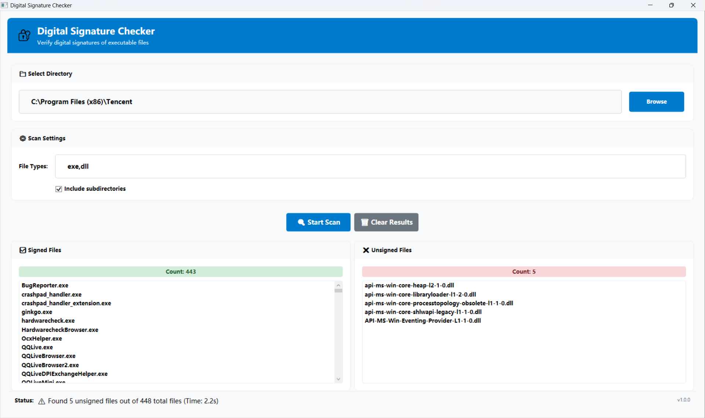

# File Signature Checker

一个用于检测指定文件夹下文件数字签名状的工具。

## 功能特性

- 📁 支持选择目标文件夹
- 🔍 支持指定文件类型检测（exe、dll 等）
- 📂 可选择是否检测子目录
- ✅ 显示已签名文件列表
- ❌ 显示未签名文件列表
- 📊 提供检测结果统计

## 项目结构

```
FileSignatureChecker/
├── src/
│   ├── FileSignatureChecker.Core/          # 核心业务逻辑类库
│   │   ├── Models/
│   │   │   └── SignatureCheckModels.cs     # 数据模型
│   │   └── Services/
│   │       └── DigitalSignatureService.cs  # 数字签名检测服务
│   └── FileSignatureChecker.UI/            # WPF用户界面项目
│       ├── MainWindow.xaml                 # 主界面 XAML
│       ├── MainWindow.xaml.cs              # 主界面代码
│       ├── App.xaml                        # 应用程序入口
│       └── FileSignatureChecker.UI.csproj  # UI项目文件
├── tests/                                  # 测试项目
│   └── FileSignatureChecker.Core.Tests/    # 核心类库单元测试
│       ├── DigitalSignatureServiceTests.cs # 服务测试
│       └── FileSignatureChecker.Core.Tests.csproj
├── FileSignatureChecker.sln                # 解决方案文件
├── README.md
└── LICENSE
```

## 系统要求

- .NET 9.0
- Windows 操作系统

## 使用方法

1. 启动应用程序
2. 点击"选择文件夹"按钮选择要检测的目录
3. 在文件类型输入框中指定要检测的文件扩展名（如：exe,dll）
4. 选择是否检测子目录
5. 点击"开始检测"按钮开始检测
6. 查看检测结果

## 程序截图

### 主界面



程序启动后的主界面，包含文件夹选择、文件类型设置和扫描选项配置。

### 扫描过程


扫描过程中的界面，显示实时进度、当前正在检测的文件以及已找到的签名文件统计。新增功能：显示已用扫描时间。

### 扫描结果


扫描完成后的结果展示，分别显示已签名和未签名的文件列表，状态栏显示总结信息和总用时。

## 技术栈

- C# / .NET 9.0
- WPF (Windows Presentation Foundation)
- Win32 API (WinVerifyTrust) 用于数字签名验证

## 架构设计

项目采用分层架构：

- **FileSignatureChecker.Core**: 核心业务逻辑类库
  - `Models`: 数据模型定义
  - `Services`: 业务服务实现
- **FileSignatureChecker**: WPF 用户界面项目

这种架构的优势：

- ✅ 关注点分离，UI 与业务逻辑解耦
- ✅ 核心逻辑可被其他项目重用
- ✅ 便于单元测试
- ✅ 易于维护和扩展

## 编译和运行

### 前置要求

- Visual Studio 2022 或更高版本
- .NET 9.0 SDK

### 编译步骤

1. 克隆或下载项目代码
2. 打开命令行，导航到项目目录
3. 运行 `dotnet build` 编译解决方案
4. 运行 `dotnet run --project src/FileSignatureChecker.UI/FileSignatureChecker.UI.csproj` 启动应用

或者：

1. 在 Visual Studio 中打开 `FileSignatureChecker.sln`
2. 生成解决方案 (Ctrl+Shift+B)
3. 设置 `FileSignatureChecker.UI` 为启动项目
4. 运行项目 (F5)

### 运行测试

```bash
dotnet test
```

## 许可证

本项目采用 MIT 许可证。详情请查看 [LICENSE](LICENSE) 文件。

## 贡献

欢迎提交 Issue 和 Pull Request 来帮助改进项目。

## 更新日志

### v1.0.0

- 初始版本
- 支持基本的文件签名检测功能
- 支持指定文件类型和子目录检测
- 重构：将业务逻辑抽取到独立的 Core 类库
